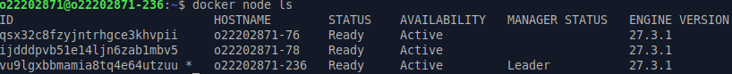
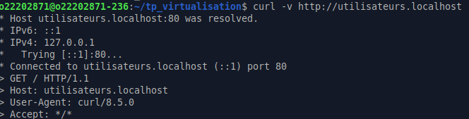

# TP VIRTUALISATION

## Création du cluster swarm

```bash
docker swarm init
```



## Les services

Nous avons besoin de créer les images pour les services à faire.

### Site web de **Reprise Contact**

On commence par déployer l'image :

```bash
docker build -t utilisateurs_web_image:latest ./services/utilisateurs/
```

Ensuite, on crée le réseau traefik public :

```bash
docker network create --driver overlay traefik-public
```

Et on crée le service :

```bash
docker network create --driver overlay web-utilisateurs
```

Après cela, on peut déployer le service :

```bash
docker stack deploy -c docker-compose.yml traefik
```

Nous en faisons alors un curl ensuite pour vérifier que le service est bien en place :



### Site web de **Cluster avec Swarm**

On commence par déployer l'image :

```bash
docker build -t cluster_web_image:latest ./services/cluster/
```